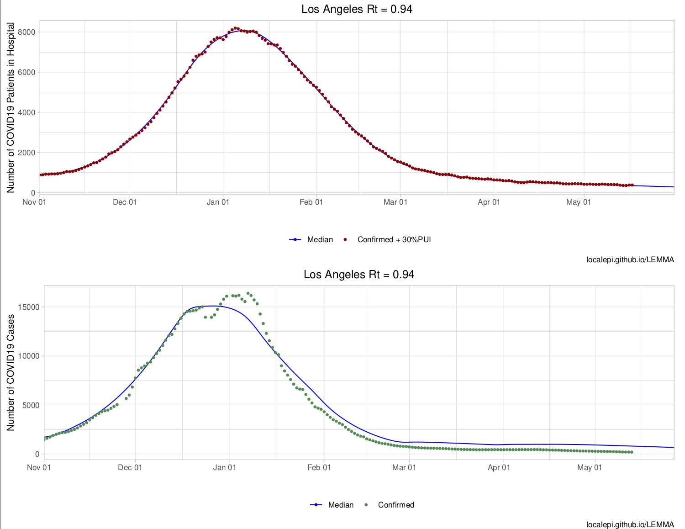
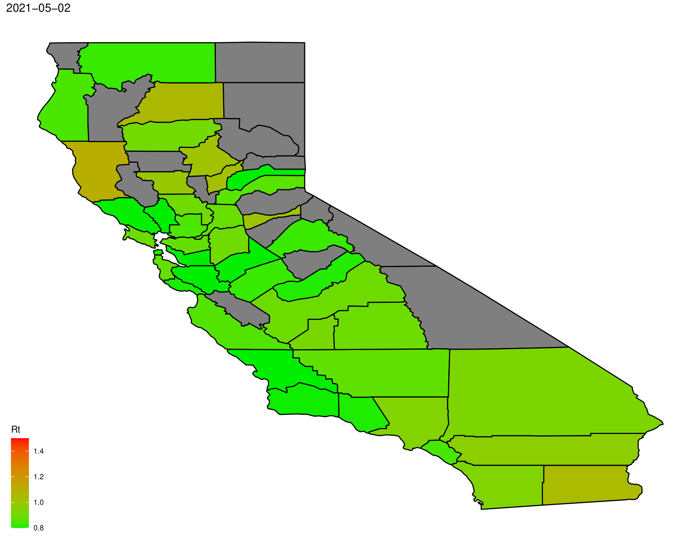

```{r, include = FALSE}
knitr::opts_chunk$set(
  collapse = TRUE,
  comment = "#>"
)
```

```{r setup}
library(LEMMA.forecasts)
library(data.table)
library(parallel)
```

This package provides an interface to [LEMMA](https://localepi.github.io/LEMMA/) which makes it easy for users to run forecasts of future disease trajectories or to simulate different scenarios taking into account future changes in variants of concern or vaccination.

This example assumes that the person running LEMMA.forecasts has not downloaded local data (found in [LEMMA-Forecasts/Inputs/](https://github.com/LocalEpi/LEMMA-Forecasts/tree/master/Inputs)), so we have not set the working directory to the base repository. Therefore the argument `remote = TRUE` is set for all functions which have that option to downloads raw data from the repository. This is slower but works regardless of the local R environment, and is used for the [LEMMA Shiny app](https://localepi.shinyapps.io/LEMMA-Shiny/).

The first step is to download data for all counties, using `GetCountyData`. This function returns a `data.table` object containing case data for each county. This takes some time to download, so please be patient. After downloading, `Get1` retrieves the maximum date for which data exists.

```{r,eval=FALSE}
county.dt <- GetCountyData(remote = TRUE)
max.date <- Get1(county.dt[!is.na(hosp.conf), max(date), by = "county"]$V1)
```

Next administered vaccine doses are retrieved.

```{r,eval=FALSE}
doses.dt <- GetDosesData(remote = TRUE)
```

Get list of counties by population.

```{r,eval=FALSE}
county.set <- county.dt[, unique(county)]
county.pop <- rowSums(readRDS(url("https://github.com/LocalEpi/LEMMA-Forecasts/raw/master/Inputs/county%20population%20by%20age.rds")))
county.set <- names(sort(county.pop[county.set], decreasing = T))
```

The `data.table` input objects can now be passed to either `RunOneCounty` or `RunOneCounty_scen` (also `RunOneCounty_scen_input`, which is designed to be used in the Shiny app allowing for adjustment of certain parameters). We will run a simple forecast using `RunOneCounty` here for time. This step takes a while as an MCMC chain has to be run for each county, so it is run in parallel. The output files can be found in a directory called `Forecasts` within the directory specified by `writedir`. Each county's report is given as a .xlsx and .pdf file, which can be viewed with `list.files(file.path(writedir,"Forecasts"))`.

```{r,eval=FALSE}
writedir <- file.path(tempdir())

system.time(
  lemma.set <- parallel::mclapply(county.set, RunOneCounty, county.dt, doses.dt, remote = TRUE, writedir = writedir, mc.cores = parallel::detectCores() - 2)
)
```

These results can be used to create an overview of the state. This will write a .pdf file "StateOverview.pdf" into the `writedir` directory. We display the first page below:

```{r,eval=FALSE}
county.rt <- CreateOverview(lemma.set,writedir = writedir)
```

```{r,echo=FALSE,out.width="50%"}

```

We can also use it to make a map of Rt.

```{r,eval=FALSE}
RtMap(max.date = max.date,county.rt = county.rt,writedir = writedir)
```

```{r,echo=FALSE,out.width="50%"}

```

<!-- ```{r} -->
<!-- file.path(writedir,rt_map) -->
<!-- ``` -->

<!-- ```{r} -->
<!-- list.files(file.path(writedir,"Forecasts")) -->
<!-- ``` -->

<!-- ```{r} -->
<!-- list.files(writedir) -->
<!-- ``` -->
